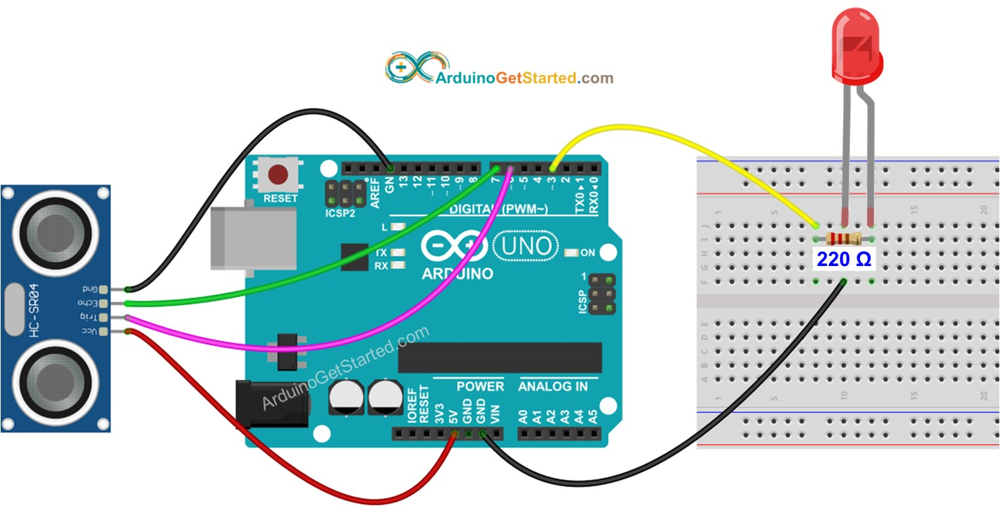
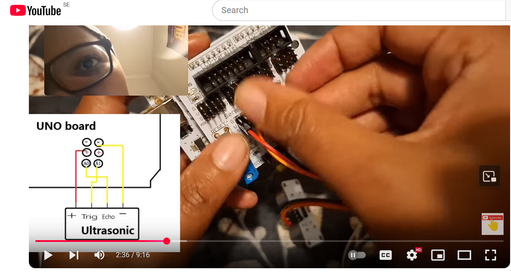

# Simple-Intruder-Alarm-Project0
Your home, Your rules -Simple Intruder alarm project using Arduino, ultrasonic sensor, LED, and #chatgpt #tutorial  Tutorial. Here is a basic Intruder alarm project using Arduino with an ultrasonic sensor & LED. Keeping your private things safe from intruders with this very simple Intruder Alarm project, it is easy to keep your accessories safe.

## Step 1: Gather all the Necessary Components
A. Arduino Uno.
B. Sensor shield (optional)
C. Ultrasonic Sensor (HC-SR04) - (An ultrasonic sensor measures the distance of an object by emitting ultrasonic sound waves. The reflected waves from the object are received by the sensor and are converted to corresponding electrical signals.)
D. Mini - BreadBoard
E. 1 kohm Resistor.
F. Jumpers wires
G. LED.

## Step 2: Connect the Components (use wiring diagrams)


## Step 3: Write Your Code (use ChatGPT) for coding
``` C++
//#create a Simple Project With the Ultrasonic Sensor (HC-SR04), LED, Arduino(ChatGPT prompt
//#(echo A0, trig A1), led pin 4, if distance is less than 100 cm, the led blinks 1 sec per blink, if distance is more than 100cm the led on breadboard shuts off

#define trigPin A1   // Trigger pin connected to A1 (Ultrasonic Sensor)
#define echoPin A0   // Echo pin connected to A0 (Ultrasonic Sensor)
#define ledPin 4     // LED connected to digital pin 4 (Breadboard LED)

long duration;  // Variable to store the pulse duration
int distance;   // Variable to store the calculated distance

void setup() {
  pinMode(trigPin, OUTPUT);  // Set trigPin as OUTPUT to send pulses
  pinMode(echoPin, INPUT);   // Set echoPin as INPUT to receive the echo
  pinMode(ledPin, OUTPUT);   // Set ledPin as OUTPUT (Breadboard LED)
}

void loop() {
  // Send a pulse to the ultrasonic sensor
  digitalWrite(trigPin, LOW);
  delayMicroseconds(2);
  digitalWrite(trigPin, HIGH);
  delayMicroseconds(10);
  digitalWrite(trigPin, LOW);

  // Read the time it took for the pulse to return
  duration = pulseIn(echoPin, HIGH);

  // Calculate the distance in centimeters
  distance = duration * 0.0344 / 2;

  // Print distance to Serial Monitor
  Serial.print("Distance: ");
  Serial.print(distance);
  Serial.println(" cm");

  // If distance is less than 100 cm, make the LED blink
  if (distance < 100) {
    digitalWrite(ledPin, HIGH); // Turn LED on
    delay(500);                 // Wait 500ms
    digitalWrite(ledPin, LOW);  // Turn LED off
    delay(500);                 // Wait 500ms/ 1 sec per blink default
  } else {
    digitalWrite(ledPin, LOW);  // Ensure LED is off when distance is greater
  }

  delay(100); // Small delay before the next measurement
}
```

## Step 4: Upload and Run (Use Arduino IDE - www.arduino.cc/en/
Watch step by step tutorial here [](https://youtu.be/Kb91wtKb6SM)


